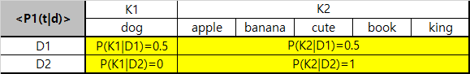

##### [Latent Dirichlet Allocation for Topic Modeling](https://www.analyticsvidhya.com/blog/2016/08/beginners-guide-to-topic-modeling-in-python/)
* LDA is a matrix factorization
* In vector space, any corpus (collection of documents) can be presented as a DTM
***
1. The following matrix shows a corpus of N documents $D_1, D_2, D_3, \ldots , D_N$ and vocabulary size of M words $W_1, W_2, W_3, \ldots , W_M$
2. The value of $cell_{ij}$ gives the frequency count of word $W_j$ in Document $D_i$
    
|(N,M)|$W_1$|$W_2$|$W_3$|$\cdots$|$W_M$|
|-|-|-|-|-|-|
|$D_1$|0|2|1|$\cdots$|3|
|$D_2$|1|4|0|$\cdots$|0|
|$D_3$|0|2|3|$\cdots$|1|
|$\vdots$|$\vdots$|$\vdots$|$\vdots$|$\ddots$|$\vdots$
|$D_N$|1|1|3|$\cdots$|0|

3. LDA converts this DTM into two lower dimensional matrices
    * $\text{M1 (N,K)}$
    * $\text{M2 (K,M)}$

* $M1$ is a **document-topics matrix** 
    
|(N,K)|$K_1$|$K_2$|$K_3$|$\cdots$|$K_K$|
|-|-|-|-|-|-|
|$D_1$|1|0|0|$\cdots$|1|
|$D_2$|1|1|0|$\cdots$|0|
|$D_3$|1|0|0|$\cdots$|1|
|$\vdots$|$\vdots$|$\vdots$|$\vdots$|$\ddots$|$\vdots$
|$D_N$|1|0|1|$\cdots$|0|
    
* $M2$ is a **topic-terms matrix**

|(K,M)|$W_1$|$W_2$|$W_3$|$\cdots$|$W_M$|
|-|-|-|-|-|-|
|$K_1$|0|1|1|$\cdots$|1|
|$K_2$|1|1|1|$\cdots$|0|
|$K_3$|1|0|0|$\cdots$|1|
|$\vdots$|$\vdots$|$\vdots$|$\vdots$|$\ddots$|$\vdots$
|$K_K$|1|1|0|$\cdots$|0|

4. These two matrices already provides topic word and document topic distributions, but need to be improved by LDA
    * LDA makes use of sampling techniques in order to improve these matrices
    * It iterates through each word $w$ for each document $d$ and it tries to adjust the current topic
    * A new topic $k$ is assigned to word $w$ with a probability $P(=P_1{\cdot}P_2)$
    

5. For every topic, two possibilities $P_1$ and $P_2$ are calculated
    * $P_1=P(\text{topic t}|\text{document d})$: the proportion of words in document $d$ that are currently assigned to topic $t$
    
    * $P_2=P(\text{word w}|\text{topic t})$: the proportion of assignments to topic $t$ over all documents that contain word $w$
    

6. The current topic - word assignment is updated with a new topic with the probability($P_1{\cdot}P_2)$
    * The model assumes that all the existing word(topic assignments) except the current word are correct
    * This is essentially the probability that topic $t$ generated word $w$
    * Then, where would word **"apple"** be belong to?
    

> Calculated probability indicates that "apple" best suits for Topic K2

7. After a number of iterations, a steady state is achieved where the document topic and topic term distributions are fairly good(**the convergence of LDA**)